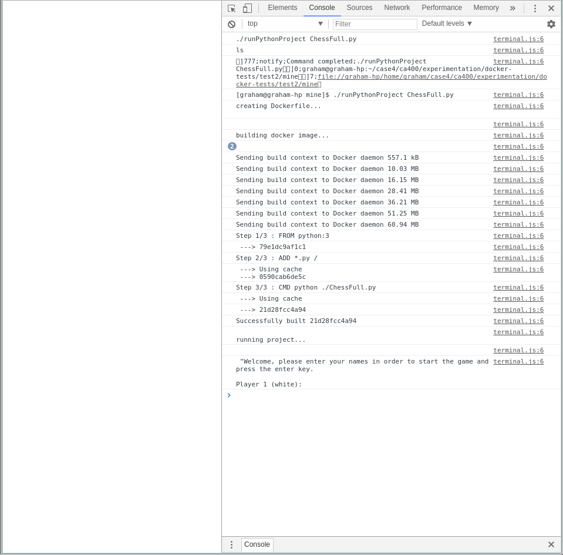
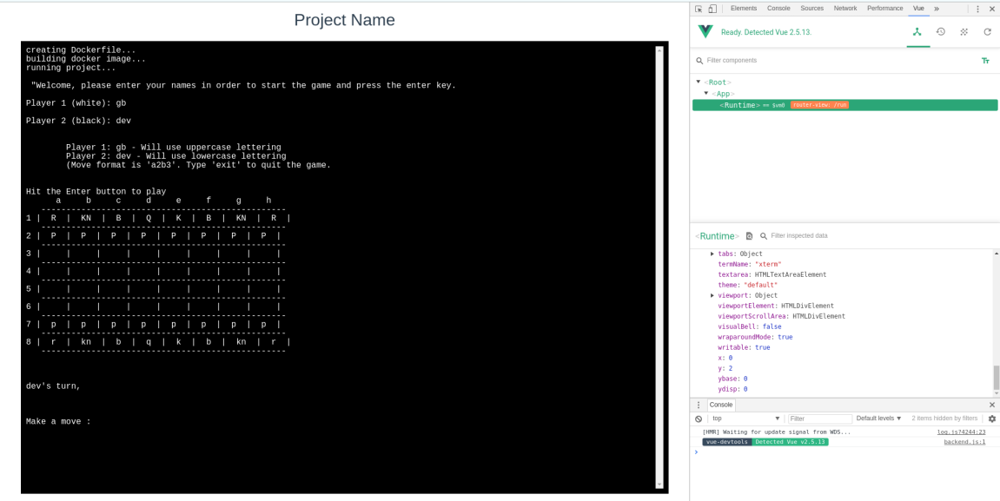
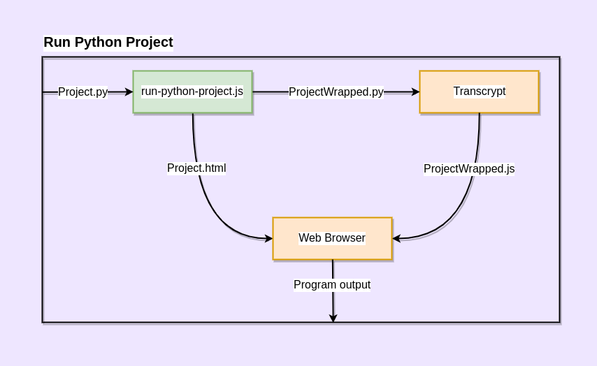
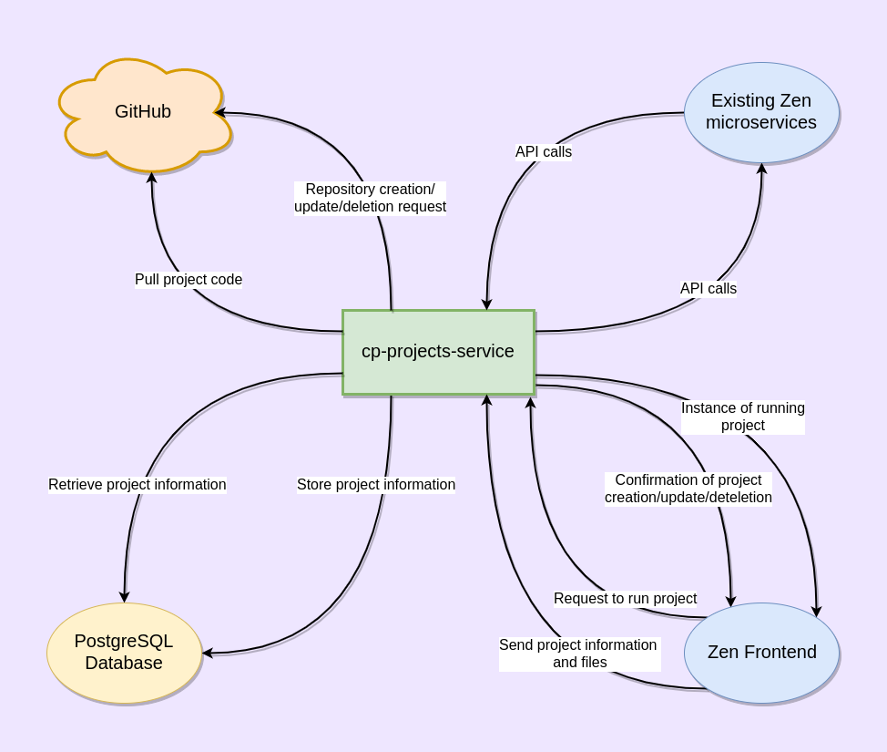
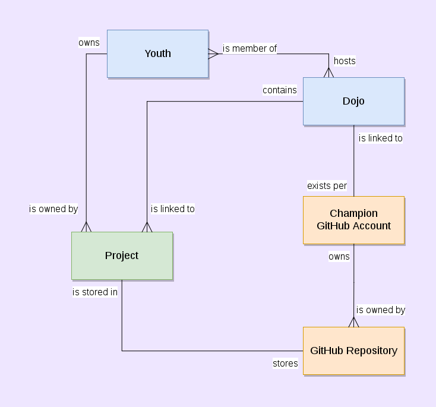
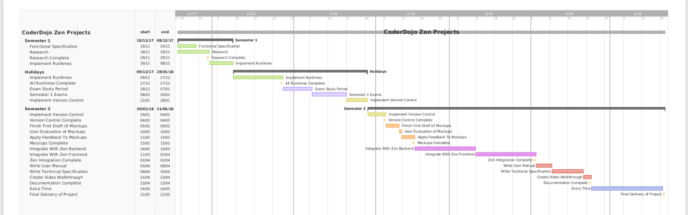
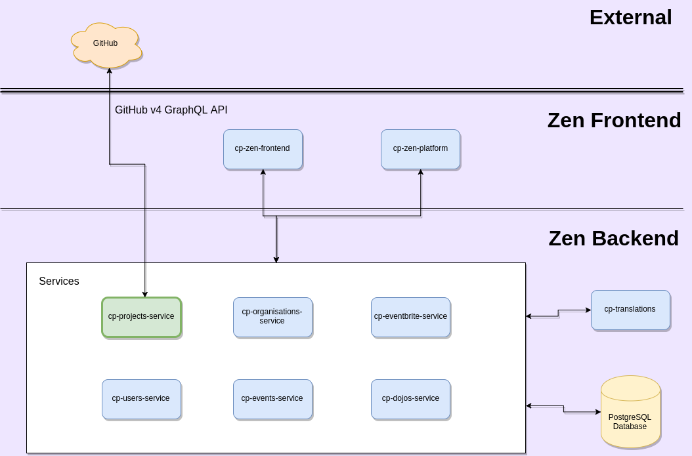

# Blog: CoderDojo Zen Projects

**Graham Bartley**

****

## Python & JavaScript Runtimes Complete, GitHub Integration Started
#### 7th February 2018

Since my last post I have pushed my prototype to GitLab and have been working on finishing project runtimes. I am happy to say that my prototype now supports running **single and multiple file** command line Python and JavaScript projects in **containerized environments**. JavaScript projects are run using NodeJS and support use of packages from npm which opens up a lot of possibilities for very creative projects.

In the process of finishing these runtime implementations I also made **several improvements** to the prototype with regard to **project creation, storage and display**. Although I still haven't styled the frontend I have improved the project list to list all projects by type with working links to allow each specific project to be run when clicked whereas before I was only able to run a project through hardcoded filenames in the runtime script. Further details on my other improvements are outlined in the commit messages on GitLab. The following bash scripts are now used to run projects which take project information as command line parameters:

**runPythonProject**
```bash
#!/bin/bash

# variables
id=$1
name=$2
main=$3

# create Dockerfile
echo "creating Dockerfile..."
rm Dockerfile &> /dev/null
touch Dockerfile &> /dev/null
echo "FROM python:3
ADD ./projects/$id/$name/* /
CMD [ \"python\", \"./$main\" ]" >> Dockerfile

# build docker image
echo "building docker image..."
docker build -t project . &> /dev/null

# run the project
echo "running project..."
echo ""
docker run -i project

# remove the image
echo ""
echo "END OF PROJECT OUTPUT"
docker rmi -f project &> /dev/null
rm Dockerfile &> /dev/null
```

**runJavaScriptProject**
```bash
#!/bin/bash

# variables
id=$1
name=$2
main=$3

# create Dockerfile
echo "creating Dockerfile..."
rm Dockerfile &> /dev/null
touch Dockerfile &> /dev/null
echo "FROM node:carbon
ADD ./projects/$id/$name/* /
RUN npm install
CMD [ \"node\", \"./$main\" ]" >> Dockerfile

# build docker image
echo "building docker image..."
docker build -t project . &> /dev/null

# run the project
echo "running project..."
echo ""
docker run -i project

# remove the image
echo ""
echo "END OF PROJECT OUTPUT"
docker rmi -f project &> /dev/null
rm Dockerfile &> /dev/null
```

With runtimes for Python and JavaScript projects complete for now I moved on to **GitHub integration for projects**. This involves making API calls to GitHub in order to create repositories for new projects, pull the code when projects are run and update the repositories when projects are updated. The first problem to be overcome here is **authentication** since all calls made to the API need to be authenticated to a particular GitHub user. While experimenting with the API I have been authenticating my API calls using a test account I made called grahambartley.

Authentication in the long-term will need to be done using **GitHub accounts of the users of Zen**, particularly the Champions of each Dojo who will allow Zen permission to use their GitHub accounts for projects of the Ninjas in their Dojos. This will be achieved using **OAuth** which is what I am working on at present. By registering an OAuth App with GitHub I can specify a **callback URL** which they will send users to after they have authenticated themselves. This callback URL will exist somewhere on Zen and will extract their authentication token and store it with their user data in order for the authentication to be persistent so they will not have to authenticate more than once.

In order for this to be attempted in my prototype, I need to have mock user data which I can use to emulate logging in, authenticating and having the authentication be persistent. In order to achieve this I have created some **mock user data** in the typical format it would have on Zen and emulated Zen login by **mocking the necessary API calls**. Once I have OAuth working in this way it will be fairly simple to integrate with Zen's existing login system due to it using the same API calls that I have mocked.

As a final note, through my experimentation with GitHub API calls I have discovered that the GitHub v4 GraphQL API does **not** contain all the functionality of the v3 REST API which I initially thought it had. Missing functionality includes **creation of repositories** which is substantial to my project. It had been my intention to exclusively use the v4 API in my project but I will have to use the v3 API for any API calls that v4 does not support. However, **I will use v4 wherever possible** since it is the newer API.

****

## Research & Exams Complete, Prototype Progress
#### 28th January 2018

After a lengthy period of exam preperation, sitting the exams and carrying out project research and experimentation I have decided on my main approach when it comes to runtimes for the project types I will be supporting. In the previous post I talked about my experimentation with Transcrypt mainly but also mentioned Brython as a possible alternative for handling project runtimes.

Unfortunately when experimenting with **Transcrypt** I ran into some unforseen issues, the main one being an error message that would be produced when running a particular Python project I was using as a test project. I tried to resolve this error in many different ways but none worked so I decided it must be an issue with how Transcrypt itself was transpiling the project. I posted an issue on the Transcrypt GitHub page and not long after that one of the developers wrote back to me confirming that it was in fact a bug with Transcrypt and that I would have to wait for the next update to fix it. I was not willing to wait since I have a schedule to keep so I went back to the drawing board and tried out Brython.

**Brython** seemed like a decent alternative on the surface but when experimenting with it I came to the realization that neither of these technologies are really suited to what I am trying to do. Both of these technologies rely on transforming some input code (in Python for example) into JavaScript which is then executed as JavaScript normally is, in a browser environment. The issue for me is that JavaScript, when being used on the frontend of an application, is generally **event-driven** rather than **blocking** in nature. This is an issue for me since the projects I am looking to run will not be event-driven.

So, with frontend solutions ruled out only backend solutions remained. I had originally hoped to run the projects on the frontend for security reasons so that project code would only ever run within the browser of the client rather than on the server where there is more risk of damage from malicious code but I began to look into ways of running code securely on the backend and I decided I would try running the projects in **Docker** containers. Docker containers allow for code to be executed within it's own lightweight environment (container) which contains only what is needed for it to run. This would potentially provide a secure solution given that the project code is never actually running in the server environment but instead in it's own environment with no access to anything outside of it's container.

Sounds like a good idea, but I will still need a way to interact with the running container through the frontend. For this purpose, I decided to try a few different JavaScript terminal emulators to allow the user to see output from the project and provide it with input if prompted to. I tried a few different ones and found **XtermJS** to be the most suitable.

Of course, the terminal and the container need some way to talk to one another and I decided **web sockets** would be suitable for this purpose. With all of this in mind and after carrying out some successful (and many failed!) experiments, I decided to begin a prototype of what my system might be like. I created a **NodeJS** application to handle my backend operations and a **VueJS** app to run the frontend since I believe these are the most suitable technologies and because it will make integration with the existing Zen code much easier (both technologies are used in Zen).

**Python runtime output in browser console using Docker and sockets (experimentation)**


After a few weeks, I have come a long way with the prototype. Although there is not much to look at on the frontend yet, I have successfully implemented the following:

  * Selection of project type
  * Upload of project code as a zip archive
  * Extraction and storage (on the server for now, will be on GitHub in future) of project files
  * Runtimes for single-file Python projects within a Docker container including:
    * Working terminal on the frontend
    * Project output appearing in terminal
    * Commands entered in terminal being sent to the running project in real time
  * Some REST API calls defined for the backend

**Python runtime output in terminal within the browser**


So far I have not committed my work to GitLab because I was unsure if this approach would be what I decide on going with. However, now that I have decided, **I will push my prototype** frontend and backend to GitLab and continue to develop from there. Once the prototype satisfies the main requirements of my project I will begin integrating it into the existing Zen stack which I have in my GitLab repository for the purpose of **tracking this integration**. In the process of doing this, I think it is reasonable to assume that my prototype frontend will become part of the cp-zen-frontend module (existing Zen frontend) and my prototype backend will become the new cp-projects-service mircoservice.

Going forward, there is still a lot to be done and I am **slightly behind my schedule**. This is mainly due to the slight misstep with transpilers (Transcrypt and Brython) which cost me some time. At this stage I originally planned on having runtimes for all project types finished and to be working on implementing version control for the uploaded projects. I envision now that I will be working on runtimes for another week or so in order to implement support for the other project types and for multiple-file Python projects. From there I will move on to using the **GitHub API** to create repositories for projects.

****

## Python Runtimes Research & Experimentation
#### 28th November 2017

This week I have been researching and experimenting with different methods of running Python code in a browser environment. I've found various existing libraries for this and experimented with the following ones which I thought might be suitable for my project:

  * [**Transcrypt**](https://www.transcrypt.org/home): Transcrypt is a Python to JavaScript transpiler. This means that it converts Python code into the equivalent JavaScript code which can then be run natively in a browser. This seems to be the most promising of the libraries I have looked at for my purposes as it provides the following benefits:
    * **Compact JavaScript**: Transpiling produces readable JavaScript with roughly equivalent file sizes as the Python source which means faster page loading. It also produces minified JavaScript with greatly reduced file sizes for even faster page loading.
    * **Debugging**: The produced JavaScript can be debugged from the source Python code using source maps which could provide useful feedback for youths uploading their projects.
    * **Runs on NodeJS**: Transcrypt runs on top of NodeJS which is what the Zen backend is built using. This is a benefit since I will be integrating this into the Zen backend if I do choose to use it. 
    * **Python libraries**: Importing of code from Python libraries is supported in the transpiling process.
    * **Client-side**: Transpiling Python into JavaScript will allow me to run Python projects client-side through the user's browser. This alleviates many security concerns that would be associated with running project code on the backend. 
    * **Open Source**: Transcrypt is an open source transpiler which is a requirement of all external libraries used as part of my project in line with CoderDojo's open source ethos.
    
    
  * [**Brython**](http://brython.info/index.html): Brython attempts to use Python directly within HTML through the use of \<script\> tags with a type="text/python" attribute. It seems very promising as an alternative to Transcrypt if I find that, for any reason, that may not be suitable.

Through my experimentation with Transcrypt, I developed a small JavaScript file to act as middleware between the Python project, Transcrypt and the web browser. The code basically reads in a Python file and wraps it in a function called main(). This code is then saved to a new file and Transcrypt is called on this wrapped code. A new HTML file is then created which will import the transpiled script and call it's main() function which effectively runs the original Python code through the browser. I've outlined the general process below in the form of a process diagram.

**Process of Running Python Projects**


This is a simple process so far and will only support projects consisting of a single Python file with command line input and output. The input and output are handled by JavaScript prompt() and console.log() corresponding to Python input() and print(). The JavaScript code I wrote can be found below:

**run-python-project.js**
```javascript
// dependencies
const fs = require('fs');
const exec = require('child_process').exec;

// store filename read in on the command line
const filename = process.argv[2];

// generate filename for wrapped file
const splitFilename = filename.split('.');
const newFilename = splitFilename[0] + 'Wrapped.py';

// generate the html file contents
const htmlFile = `<html>
  <head>
    <script src="./__javascript__/` + splitFilename[0] + `Wrapped.js"></script>
  </head>
  <body>
    <div id="input-div">
    <center>
      <form>
        <input type="text" id="input" width="500px"></input>
        <button type="submit">Enter</button>
      </form>
    </center>
    </div>
    <div id="output"></div>
    <script>
    `+ splitFilename[0] + `Wrapped.main();
    </script>
  </body>
</html>
`;

// read in the file
fs.readFile(filename, 'utf8', (err, res) => {
  // report errors
  if (err) {
    return console.log(err);
  }
  
  // variables
  let resLines;
  let newFile = '';
  let firstRun = true;
  
  // wrap the code with def main():
  res = 'def main(): \n' + res;
  
  // split the code into lines
  resLines = res.split('\n');
  
  // for each line in the code
  resLines.forEach((line) => {
    // indent each line but the first
    if (!firstRun) {
      newFile += '  ' + line + '\n';
    } else {
      newFile += line + '\n';
      firstRun = false;
    }    
  });
  
  // save the new file with the newFilename
  fs.writeFile(newFilename, newFile, 'utf8');
});

// save the html file
fs.writeFile(splitFilename[0] + '.html', htmlFile, 'utf8');

// run transcrypt shell script to transpile Python to JavaScript
exec('transcrypt ' + newFilename, (err, stdout, stderr) => {
  // output syntax errors
  if (err !== null) {
    console.log(`exec error: ${err}`);
  }
  
  // output results and runtime errors
  console.log(`${stdout}`);
  console.log(`${stderr}`);
});

// open html file in Google Chrome
exec('google-chrome ' + splitFilename[0] + '.html', (err, stdout, stderr) => {
  // output syntax errors
  if (err !== null) {
    console.log(`exec error: ${err}`);
  }
  
  // output results and runtime errors
  console.log(`${stdout}`);
  console.log(`${stderr}`);
});
```

This JavaScript code assumes the file name of a Python file has been passed as a command line argument and transcrypt and google-chrome are available in the system $PATH. I have validated that it will work with the following types of Python projects:

  * Single file, output only, no imports
  * Single file, input and output, no imports
  * Single file, output only, with imports

With this simple Python runtime working using Transcrypt, I will be experimenting further to see if I can achieve runtime for projects with multiple files and graphical outputs. I will also be experimenting with overriding command line input and output methods to allow input to programs from a HTML input field and output to a HTML div rather than the developers console of the browser.

****

## Functional Specification Complete
#### 20th November 2017

This week I completed my functional specification which details what my project will achieve from a high-level functional point of view. I created the following diagrams and Gantt Chart as part of this:

**Context Diagram**


**Logical Data Model**


**Gantt Chart of Project Schedule**


I am doing a final proof-read and making any necessary last minute modifications to my functional specification before adding it to my GitLab repository. I also met with the CoderDojo Foundation this week to update them on my progress with the project which they were happy with. I have set up monthly meetings with them from now on in order to continue to keep them up to date as well as the weekly meetings I have already set up with my project supervisor.

The focus of next week is to continue researching how best to implement runtimes for Python, HTML/CSS/JavaScript and JavaScript-only projects since this is likely to be the most complex part of my project. I want to decide on how to do this so that I can begin to implement runtimes early in case any unexpected issues arise.

****

## First Draft Functional Specification
#### 14th November 2017

This week I worked on writing a first draft of my functional specification. I didn't make as much progress with it as I would have liked due to working on assignments for other modules and lab work. However, I did finish the first and fourth sections including a high level System Architecture diagram which I spent a lot of my time working on:



Although I said I wouldn't continue the UI mockups for a while, I decided to fill in what I could for now for the "New Project Creation Page" so that I would have a better idea of exactly what areas of it I am unsure on. My mockup from this week can be seen below:

(pt.2).png)

This week I am continuing my first draft of the functional specification and will have more time to dedicate to it. I am aiming to have the first draft finished by next week.

****

## More UI Mockups & First User Stories
#### 6th November 2017

Last week I worked on creating some more UI mockups and writing user stories. I didn't make as much progress with the UI mockups as I would have liked but I did spend a lot of my time writing and prioritising user stories on my project tracker which can be found here: [My project tracker](https://www.pivotaltracker.com/projects/2122879). My new UI mockups can be seen following:

**Edit Profile Page - Your Projects Section (Logged in)**
.png)

**New Project Creation Page (Logged in) - WIP**
.png)

Clearly, the "New Project Creation Page" is still work in progress (WIP) and this is because I haven't yet decided on how privacy settings for projects are going to work. This brought me to the decision that I am going to focus more on research and completing my functional specification this week so that I can better define these kinds of details. Once I have clear decisions on implementation for the important aspects of my project I will return to the UI mockups.

With regard to user stories, I created and prioritised 13 user stories for the persona of Niamh this week. I also created a number of chores on my tracker for myself to complete as part of my research phase and beyond so that I have a clearer focus and prioritisation when it comes to my research.

In addition to this, I realised that I had missed a user type when creating my personas. I had not considered a CoderDojo Foundation employee as a user type. In order to provide for this user type, I created the following new persona:

  * **Paul (CDF Employee)**: Paul is 26 years old. He is a member of the community team at the CoderDojo Foundation. As part of his job, he wants to onboard a lot of new members to Zen and ensure that current users are engaging with Zen and enjoying their experiences with it. In order to do his job effectively, he needs statistics from Zen and administrative abilities over content existing on Zen.

This week, as I have said, I will be focusing on research and writing my functional specification which is due on the 24th of November. By shifting my focus to these things, I feel that I will be better able to make decisions to reduce the amount of unknowns in my project now and then focus on implementation and testing.

****

## Project Approval & Next Steps
#### 29th October 2017

I had my approval panel session on Monday 23rd October and after discussing my project with the panel, it was approved. I was also given some useful feedback to consider throughout the year as I work on it. This is the main feedback I was given:

  * **Languages**: The release date of Scratch 3 being an unknown poses a major risk for the project, I should focus on implementing runtime for Python well instead of focusing on Scratch. Once one language is well supported and the runtime is abstracted enough, other languages are not completely necessary.
  * **Testing**: Focus on testing throughout the project and not just towards the end, both technical and user-oriented.
  * **Demonstration**: When it comes to demonstrating my project I should showcase the lifecycle of using my project from each user's perspective.

Following on from my approval session, I decided to continue drawing up some early user interface (UI) mockups I have been working on for the past few weeks. Once they are finished I will be able to show them to potential users and the CoderDojo Foundation (CDF) for feedback. These are the ones I have drawn up so far which are early concepts and will certainly change as the project goes on:

**Project Page (Logged in)**
.png)

**Project Page - Running (Logged in)**
.png)

**Project Page - Dropdown Options (Logged in)**
.png)

**My Projects - Parent Perspective (Logged in)**
.png)

**Dojo Page Projects Section**


I have also decided to create personas for each user type I will need to consider when working on the project. These will become useful when writing user stories and will ensure my project is always designed with it's users in mind. The personas I have created are as follows:

  * **Niamh (Youth)**: Niamh is 12 years old. She has been attending her local Dojo for three years since the age of 9. She started out by attending Scratch sessions and then moved on to Web Design and more recently Python. She works on coding projects in her spare time with her friends and showcased some of her work at the Coolest Projects event in the RDS in Dublin, Ireland in 2017.
  * **Steven (Parent)**: Steve is 34 years old. He is the father of two children, one of which is Niamh. He is a radio show host and doesn't like to use computers much in his spare time out of personal preference. However, he does support his daughter's passion for technology and has a Zen account for this reason.
  * **Allie (Mentor)**: Allie is 21 years old. She has been a mentor at her local Dojo for two years now teaching the youths Scratch, HTML, CSS, JavaScript and Python. She is in her final year studying in university and has a part-time job in a clothing shop. She volunteered to help run Coolest Projects 2017.
  * **Chris (Champion)**: Chris is 52 years old. He is the champion of his own Dojo which he set up five years ago. He has worked in the technology industry his whole life and is now a product manager for a major software company. He is passionate about teaching youths how to code and promoting interest in technology at an early age.

Using these personas I can then begin to write user stories which I will be keeping track of using my own project board on [Pivotal Tracker - an agile software development tracker](https://www.pivotaltracker.com/). I have shared this board with my project supervisor and with relevant members of the CoderDojo Foundation so that they will all be kept up-to-date on my progress with the project. Writing these stories and continuing to create UI mockups will be what I focus on for the next week.

****
