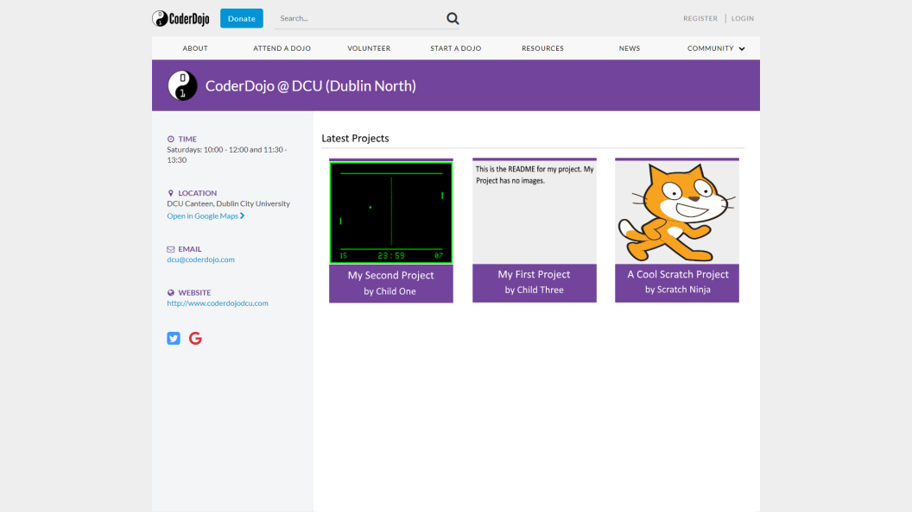

# Blog: CoderDojo Zen Projects

**Graham Bartley**

****

## Project Play Tracking, Sharing and Resource & Project List Styling
#### 5th April 2018

I have been working primarily on implementing further **features for projects** and have implemented the following:

  * **Play Tracking**: Projects now keep track of **how many times they have been "played"** which means run for Python 3, NodeJS and Java projects and viewed for HTML5 projects. This value is displayed for each project and used to sort projects by "Most Played" in the Project List.
  * **Sharing**: The share button on the Project Information page now gives a link to the project with an option to copy to clipboard for **easy sharing** of the project.
  * **Resource**: An optional resource link can now be given when creating or updating a project which can be used to **link to CoderDojo learning resources** used to create/inspire the project. I have spoken with the CoderDojo Foundation (CDF) with regard to restricting this URL to a specific CoderDojo domain to prevent malicious/inappropriate links but as of right now they are building a new system for resources which is not ready yet so I have not restricted the domain yet.
  
These features can be seen in this screenshot:

**Project Information Page**


Tracking plays allowed me to go on to finish **styling the Project List page** which was the most complex of my mockups to complete. This was largely due to the fact that I had to **paginate** projects when listing them in order to keep the page length reasonable. I have now completed the Project List styling and it can be seen below but the search functionality is not yet implemented.

**Project List Page**


I also made several other small **changes to the frontend** styling including:

  * Refactored class names
  * Changed ordering of items in the sidebar on the Project Information page
  * Changed icons for some headings and links
  * Added "view" buttons to edit pages to allow navigating back from edit to view
  * Basic styling for profile pages since they are only placeholders for real Zen pages
  * Added CoderDojo logo and profile dropdown to the common header which is also a placeholder for the real Zen header
  * Hid certain elements based on logged in user type (for example, "Create a Project" button only shows up for youths now since only youths can create projects)
  
With regard to the **Admin Panel**, I met with the CoderDojo Foundation on the 23rd March and showed them my mockups for it in order to get their **feedback** since they are the the admins that would be using it. As it turned out, the Admin Panel is actually **aimed more at Champions** (owners of Dojos) than the CDF directly but the **CDF should still have access to it**. Also, I had originally included some statistical charts in my mockups but these are **not required** since the CDF use a suite to automatically generate charts and reports already which will work in the same way for my project once it's integrated into Zen.

With this feedback in mind, I have decided I will need to create a **Dojo page** for each Dojo as a **placeholder** in my project for the existing Zen Dojo page since that will be the most appropriate place for Champions to access the Admin Panel for their Dojo. I have also decided that it makes more sense for the **GitHub Oauth workflow** to begin in the Admin Panel since GitHub integrations exist **per Dojo, not per user**. Currently this begins on the Edit Profile placeholder page so I will be moving this and modifying the endpoint to be a **dojos endpoint** rather than users.

I have also **fixed a major bug with runtimes** which was causing output from one project to appear when running another project. This was caused by runtime processes never terminating if they wait for input but the user leaves the page. I solved this by destroying the runtime process when the user leaves the page.

Another fairly **major change** I made was to **restructure** the files in cp-projects-service to be more **modular**. I decided this change was needed because all of my endpoints and socket functionality existed in the one server file which was getting quite long. I split this file into the following **new structure**:

  * api/
    * dojos/
      * endpoints.js
    * projects/
      * endpoints.js
    * users/
      * endpoints.js
    * server.js
  * services/
    * web-socket-service.js
    
I think this will be much more **maintainable** in the long run.

As a final note for this post, it was brought to my attention last week by Stephen Blott and Paul Clarke that there is a **potential issue with my project GitLab repository** since a repository check for it failed. I am not noticing any issues on my end and tried the following to make sure:

  * Created a **fresh clone** of my repo locally and ran **git fsck**, there were no issues, just dangling data
  * Made a **trivial change** locally and committed, pushed and merged it without any issues
  
The issue has been closed as of now with the hope that the repository check failing is **harmless** but I will be **checking regularly** to see if I notice any issues.

****

## Implementing Mockups & Further Refining Runtime and Version Control Functionality
#### 22nd March 2018

Since my last blog post I have been hard at work **implementing my designs** into my Vue components. I've implemented styling for the following pages so far:

  * Project Creation
  * Project Information
  * Project Runtime
  * Edit Project
  * Mock Login
  
I have yet to style the **Project List** page and am aiming to do that in the coming days but it is arguably the most difficult of my mockups to implement due to the **pagination of list contents** and also because not all of the functionality behind it has been **implemented yet** (I do not yet have statistics tracking for project runtimes or a search system for projects). I will likely only complete these features after styling the page. Screenshots of the pages I have listed above are given here:

**Styled Project Creation Page**


**Styled Project Information Page**


**Styled HTML5 Project Information Page**


**Styled Project Runtime Page**


**Styled Edit Project Page**


**Styled Mock Login Page**


Another issue I wanted to address from the last blog post was **version control integration with relation to creating and updating projects**. I have **completely reworked** how I add files to the project GitHub repositories using the **[Git Data API](https://developer.github.com/v3/git/)** which allows for much more specific requests but is quite technical compared to the normal API calls so it took some time to understand and was certainly a **learning curve** for me.

However, I spent time **learning how it works** and was able to use it to commit, push and merge unzipped project files to their respective repositories and remove existing files in the process which **fixes my project update issue**! This way of handling version control is also **much better** for the following reasons:

  * Repositories now contain the source code for the project whch can be viewed in the repository rather than just a zip file to be downloaded which facilitates **reading of project code**
  * Runtime containers now have less work to do since they don't have to unzip project archives after cloning them from GitHub, they can just **run them directly** instead
  * Having project files directly in the top level of the repository allows for **HTML5 projects to be viewed** using GitHub pages
  
Once I had made these changes to the version control integration I decided to add the **HTML5 project support** that I had been waiting to add since it could not be done until the project files were properly versioned. In order to do this I push files for HTML5 projects to the **gh-pages branch** of their repository rather than master. This activates GitHub pages so that the HTML5 project can be viewed at the **GitHub pages URL** for that repository. I then added an iframe to the Project Information page instead of the run button when viewing a HTML5 project so that you can **see and interact with the project directly on it's page** (this can be seen in the HTML5 project screenshot above). I also added a link to view it externally so that it can be viewed in fullscreen.

Leading on from this, I decided to work on **improving the speed and efficiency of my runtimes** since they were slower than I would like and there was certainly room for improvement. The process I had each time a project was run was:

  * Create Dockerfile specific to project being run
  * Build image from Dockerfile
  * Run a container of the image until stopped
  * Remove the image
  * Remove the Dockerfile
  
Rather than building an image specific to the project each time and removing it afterwards which can take a lot of time, it makes more sense to create **generalised images** for each project type being run, build these once and store them somewhere to be used each time a project of that type is run. The information specific to the project being run can be passed as **environment variables** to the generalised image.

In order to do this I created a Dockerfile for each project type and used them to build images which set up an environment around a base image and call a **docker-entrypoint** script. The docker-entrypoint script then contains commands that the container will execute to clone the project repoisitory, install dependencies and run the project. Only **two environment variables** are needed when running a container of the images:

  * The URL of the project's GitHub repository
  * The name of the entrypoint file for the project
  
For storage of the generalised images I used **[DockerHub](https://hub.docker.com/r/coderdojo/project-runtime/)** which stores **repositories of images** and allows them to be pulled using docker commands. I contacted the CoderDojo Foundation (CDF) in order to get permission to **create a repository under the coderdojo organisation** on DockerHub since this is where all of the other Zen docker images are kept. Once I had permission I created a repository called **coderdojo/project-runtime** which can be seen in the screenshot below. It's one repository which contains multiple images for different project types which can be specified when pulling it using **tags**.

**Project Runtime Image on DockerHub**


So, with all of this having been done the **new process** for running projects is as follows:

  * Pull the image for this project type from DockerHub (**this will only happen once**, the image will be stored on the server after this)
  * Run a container of the image (with environment variables for the project being run) until stopped
  
Much simpler! It is also **a lot faster** in practice especially since the image for each project type **only needs to be pulled once** from DockerHub and then it will be available on the server for any other project of that type to use.

Following on from this, I decided to add support for creating, displaying and running **Java projects** since Java was one of the languages I wanted to support as a stretch goal. I am happy to say that it was **not very time-consuming or difficult to add support for** since everything around it is already built. I basically had to build an image for Java projects and push it to DockerHub and then add to the frontend to allow java projects to be created and displayed and that was it. This is good because I want my system to be **easily extendible** when it comes to adding support for other languages in the future and I believe I have achieved that now.

****

## Results of User Evaluation & Styling
#### 13th March 2018

On Saturday 10th March I carried out a **user evaluation session** with some of the **Ninjas at CoderDojo DCU**. The purpose of this session was to **gather feedback** from them on my proposed User Interface designs which I had created in the form of mockup images. I created a **feedback form** which I printed several copies of alongside the **mockups** themselves, the **informed assent and consent forms** and the **plain language statements**. I stapled these together logically and gave one stapled group to each of the participants during the session. I explained my project and what I was expecting of them. Once I had consent of the participant and the parent/guardian of the participant I asked them to look at images of my mockups and give their **written feedback** on their feedback form.

At the end of the session I distributed some **CoderDojo stickers and badges** to the Ninjas who took part. When the Dojo was over I scanned in the feedback forms which are now **available in my project GitLab repository** in the **docs/testing/user-evaluation/ninjas** directory and are anonymized. I read through the feedback and created a **conclusions document** so I could clearly see the results of the session. This document is **also available** in the same directory. In general, the results were as follows:

  * **Create Project Page**
    * Requests for additional programming languages to be supported (Lua & Scratch)
  * **Project Information Page**
    * More bright colours could be added
    * Link to project creator needed
    * Request for a counter of project interactions
    * Request for a comments system
  * **Running Project Page**
    * Design not visually appealing enough
  * **Project List**
    * Requests for additional categories & filtering by genres
    * Design not visually appealing enough (possibly?)

Based on this feedback I have been **modifying** my User Interface for these pages to include any of the points that I feel I can include within the scope of the project. Once a design is complete I will **implement the styling** for it. I have already implemented the styling for the Create Project page since adding additional programming languages is more of a functional issue than a design issue.

Once all of the styling has been done I will resume working on **update of projects with versioning** since there are still issues with this at the moment.

****

## Database Set Up, Project Update and Deletion & Basic Styling
#### 26th February 2018

Since my last post I have been working on **setting up a PostgreSQL database** to replace the file system approach to data storage that I was using previously. This involved initialising the database, writing a migration for it, running the migration when the microservice starts, allowing the microservice to interact with the database and replacing all existing file system calls with equivalent or improved database calls. During this process I went through **several iterations** of the migration until settling on one that made the most sense for what I am doing. There are four tables created in this migration which are as follows:

  * **users:** a basic mock of the existing Zen users database main table
  * **dojos:** a basic mock of the existing Zen dojos database main table
  * **github_integrations:** a new entity to represent a GitHub integration
  * **projects:** a new table used to store project data

I have included basic **mocks of users and dojos** because my prototype will need to handle both without access to Zen's databases. A **GitHub integration** here represents a relationship between a user, a dojo and a GitHub access token. This relationship has it's own unique id which I generate and store alongside them. I had to rework a lot of the existing code to work around this since I had been storing the access token as part of the user data before. I believe this new approach will be **much more appropriate** since a single user could potentially be a champion of multiple Dojos and so may be linked to multiple access tokens. The **projects table** stores the project information which was previously being stored in project-data.json per project and also includes a link to the user who owns the project via their user id and the GitHub integration entity it uses via a GitHub integration id. Below is the described migration file.

**001.do.init.sql**
```sql
-- tmp table for prototype
CREATE TABLE IF NOT EXISTS users (
  id varchar NOT NULL,
  email varchar,
  name varchar,
  dojos varchar[],
  PRIMARY KEY (id)
);

-- tmp table for prototype
CREATE TABLE IF NOT EXISTS dojos (
  id varchar NOT NULL,
  name varchar,
  PRIMARY KEY (id)
);

CREATE TABLE IF NOT EXISTS github_integrations (
  github_integration_id varchar NOT NULL,
  user_id varchar NOT NULL,
  dojo_id varchar NOT NULL,
  github_access_token varchar,
  PRIMARY KEY (github_integration_id),
  FOREIGN KEY (user_id) REFERENCES users(id),
  FOREIGN KEY (dojo_id) REFERENCES dojos(id)
);

CREATE TABLE IF NOT EXISTS projects (
  project_id varchar NOT NULL,
  name varchar,
  type varchar,
  entrypoint varchar,
  description varchar,
  github varchar,
  created_at timestamp,
  updated_at timestamp,
  author varchar,
  user_id varchar NOT NULL,
  github_integration_id varchar,
  deleted_at timestamp,
  PRIMARY KEY (project_id),
  FOREIGN KEY (user_id) REFERENCES users(id),
  FOREIGN KEY (github_integration_id) REFERENCES github_integrations(github_integration_id)
);
```

Once I had my prototype **"talking"** to my database happily I moved on to the next items on the backlog: **project update and deletion** and further **fleshing out the GitHub integration**. I started by modifying the project creation code so that uploaded **code is now pushed to the automatically created repository** for each project. With this working I was able to then **pull project code** within the runtime scripts in order to run it so that the project code is never actually stored locally on the server itself which allowed me to remove some file-related dependencies (file-system and adm-zip) which I was using for this purpose before. At present the project files are being uploaded to GitHub in their **zipped format** and then unzipped within the runtime scripts. I would prefer to unzip them prior to uploading them to GitHub but the GitHub API seems to allow for committing of one file at a time. I will need to look into this further but I would like to upload all files in the project after they've been unzipped in the future if it seems reasonable.

With this working I was able to move on to updating and deleting projects. For project deletion I went with a **soft delete** approach whereby I simply store a timestamp value with the project data which represents when it was deleted, the frontend then only displays projects which don't contain this value. The advantage to this approach is that the project data still exists for **statistical reasons** and should it ever need to be **restored**. Project update proved to be a lot more challenging. I created a new "Edit Project" page which allows the owner of a project to edit the following properties:

  * name
  * description
  * entrypoint
  * files
  
The first three are fairly simple updates to the projects table in the database for that specific project but **updating files is more complicated**. I have given the user the facility to upload another zip file which I then commit to the existing repository for this project. If a zip file with the same name as the one being uploaded exists in the repository then it will be updated, otherwise a new file will be created. This causes some problems though since the runtime scripts unzip all code that they pull from GitHub which **potentially means conflicts** in unzipping two versions of a project which have different zip file names and thus having conflicting files merging/overwriting each other. This is something **I am still working on resolving** but where the zip files have the same name, the update works.

Alongside these changes I made multiple **changes to frontend workflows** including OAuth, project creation and project listing. The "Project List" now displays links to "Project Details" pages which are a new page I created to contain information for any given project. The **runtime links** are now located on these pages and project owners can get to the "Edit Project" page through a **new button** on them. The "Edit Project" page also contains a **button to delete the project**. The project creation form now asks for a **Dojo input** in order to link a project to a particular GitHub integration associated with that Dojo. The list of Dojos offered is generated based on the Dojos that the owner of the project is part of. 

I have also added **common header and footer** components which wrap around all pages of the prototype. These offer links to **login, logout, project list and acknowledgements** which are useful for the prototype. During integration they will be replaced with the existing Zen header and footer. I made a lot of **basic styling changes** to accompany these frontend changes which make the prototype easier and more pleasant to use while giving me an idea of what the styled prototype might look like.

With regard to the **actual designs** for the frontend, I am in the process of seeking **ethical approval** to carry out user evaluations of my User Interface mockups which I hope to carry out with some of the **Ninjas at CoderDojo DCU on the 10th of March**. I have spoken to the organisers of that Dojo where I volunteer as a mentor every Saturday and they have allowed me to carry this out provided I have consent of the Ninjas taking part which I will ask them for once I have ethical approval. I am hoping that getting **user feedback** from these youths who are the **target users** of my project will be very beneficial in learning more about what they would like from it and how suitable my existing mockups are.

As a final note, I have been keeping my eye on news of **Scratch 3** since runtime support for it has been a possible stretch goal of the project since it began. Unfortunately, I recently seen that Scratch 3 is confirmed to be scheduled for an **August 2018** release date which will be far **out of the schedule** of this project and so I will **not** be able to support it. However, another possible stretch goal is Java support which seems **entirely possible** given the work I have already done so I will hopefully be able to support Java provided I finish my prototype in time.

****

## GitHub OAuth Complete, Unit Testing & Continuous Integration
#### 17th February 2018

Users of my prototype can now login and click a link to **Authorize my application to make changes on their GitHub account** using a GitHub OAuth app. The access token I retrieve for each user is stored with their data which will be stored in the database once that is setup. Any GitHub API calls made while logged in as that user are then made using that user's account. In future this will be the account of the Champion user who has authorized use of their GitHub rather than the youth who is logged in.

**GitHub OAuth integration**


Each time a new project is created, a **GitHub repository is created** for it on that user's account named using the id of the project to ensure that all project names are unique and since the repository does not need a human-readable name. So far I have not set it up to add project files to the repositories but will be doing so soon.

Since finishing the GitHub Oauth integration I have been working on writing **unit tests** for all of my prototype code to ensure that my code has good coverage. I've written unit tests for the frontend and the backend now and have **97% statement coverage** on both. I plan to keep a high level of coverage as I go on in the project by testing alongside writing code in future. Along with these tests I also added a **.gitlab-ci.yml** file to my project in order to have my tests run each time I push new code to GitLab to ensure that my tests are always passing before I merge new code. 

I had a **meeting with the CoderDojo Foundation** last Friday to update them on my progress and they were happy with how the project is coming along. I demonstrated the functionality I have so far and asked them if there was anything that they would like me to address. One thing they mentioned is that I should **replace the file system approach to data storage by using a database** for my prototype. I originally decided not to do this because I thought I would be using the existing Zen database directly during the integration phase. However, they pointed out that Zen actually has multiple databases and so a new database would be created for projects anyway during the integration phase so it may save time in the long run to create one now. I will be working on this next since I have deemed it high priority for the completion of the prototype.

****

## Python & JavaScript Runtimes Complete, GitHub Integration Started
#### 7th February 2018

Since my last post I have pushed my prototype to GitLab and have been working on finishing project runtimes. I am happy to say that my prototype now supports running **single and multiple file** command line Python and JavaScript projects in **containerized environments**. JavaScript projects are run using NodeJS and support use of packages from npm which opens up a lot of possibilities for very creative projects.

In the process of finishing these runtime implementations I also made **several improvements** to the prototype with regard to **project creation, storage and display**. Although I still haven't styled the frontend I have improved the project list to list all projects by type with working links to allow each specific project to be run when clicked whereas before I was only able to run a project through hardcoded filenames in the runtime script. Further details on my other improvements are outlined in the commit messages on GitLab. The following bash scripts are now used to run projects which take project information as command line parameters:

**runPythonProject**
```bash
#!/bin/bash

# variables
id=$1
name=$2
main=$3

# create Dockerfile
echo "creating Dockerfile..."
rm Dockerfile &> /dev/null
touch Dockerfile &> /dev/null
echo "FROM python:3
ADD ./projects/$id/$name/* /
CMD [ \"python\", \"./$main\" ]" >> Dockerfile

# build docker image
echo "building docker image..."
docker build -t project . &> /dev/null

# run the project
echo "running project..."
echo ""
docker run -i project

# remove the image
echo ""
echo "END OF PROJECT OUTPUT"
docker rmi -f project &> /dev/null
rm Dockerfile &> /dev/null
```

**runJavaScriptProject**
```bash
#!/bin/bash

# variables
id=$1
name=$2
main=$3

# create Dockerfile
echo "creating Dockerfile..."
rm Dockerfile &> /dev/null
touch Dockerfile &> /dev/null
echo "FROM node:carbon
ADD ./projects/$id/$name/* /
RUN npm install
CMD [ \"node\", \"./$main\" ]" >> Dockerfile

# build docker image
echo "building docker image..."
docker build -t project . &> /dev/null

# run the project
echo "running project..."
echo ""
docker run -i project

# remove the image
echo ""
echo "END OF PROJECT OUTPUT"
docker rmi -f project &> /dev/null
rm Dockerfile &> /dev/null
```

With runtimes for Python and JavaScript projects complete for now I moved on to **GitHub integration for projects**. This involves making API calls to GitHub in order to create repositories for new projects, pull the code when projects are run and update the repositories when projects are updated. The first problem to be overcome here is **authentication** since all calls made to the API need to be authenticated to a particular GitHub user. While experimenting with the API I have been authenticating my API calls using a test account I made called grahambartley.

Authentication in the long-term will need to be done using **GitHub accounts of the users of Zen**, particularly the Champions of each Dojo who will allow Zen permission to use their GitHub accounts for projects of the Ninjas in their Dojos. This will be achieved using **OAuth** which is what I am working on at present. By registering an OAuth App with GitHub I can specify a **callback URL** which they will send users to after they have authenticated themselves. This callback URL will exist somewhere on Zen and will extract their authentication token and store it with their user data in order for the authentication to be persistent so they will not have to authenticate more than once.

In order for this to be attempted in my prototype, I need to have mock user data which I can use to emulate logging in, authenticating and having the authentication be persistent. In order to achieve this I have created some **mock user data** in the typical format it would have on Zen and emulated Zen login by **mocking the necessary API calls**. Once I have OAuth working in this way it will be fairly simple to integrate with Zen's existing login system due to it using the same API calls that I have mocked.

As a final note, through my experimentation with GitHub API calls I have discovered that the GitHub v4 GraphQL API does **not** contain all the functionality of the v3 REST API which I initially thought it had. Missing functionality includes **creation of repositories** which is substantial to my project. It had been my intention to exclusively use the v4 API in my project but I will have to use the v3 API for any API calls that v4 does not support. However, **I will use v4 wherever possible** since it is the newer API.

****

## Research & Exams Complete, Prototype Progress
#### 28th January 2018

After a lengthy period of exam preperation, sitting the exams and carrying out project research and experimentation I have decided on my main approach when it comes to runtimes for the project types I will be supporting. In the previous post I talked about my experimentation with Transcrypt mainly but also mentioned Brython as a possible alternative for handling project runtimes.

Unfortunately when experimenting with **Transcrypt** I ran into some unforseen issues, the main one being an error message that would be produced when running a particular Python project I was using as a test project. I tried to resolve this error in many different ways but none worked so I decided it must be an issue with how Transcrypt itself was transpiling the project. I posted an issue on the Transcrypt GitHub page and not long after that one of the developers wrote back to me confirming that it was in fact a bug with Transcrypt and that I would have to wait for the next update to fix it. I was not willing to wait since I have a schedule to keep so I went back to the drawing board and tried out Brython.

**Brython** seemed like a decent alternative on the surface but when experimenting with it I came to the realization that neither of these technologies are really suited to what I am trying to do. Both of these technologies rely on transforming some input code (in Python for example) into JavaScript which is then executed as JavaScript normally is, in a browser environment. The issue for me is that JavaScript, when being used on the frontend of an application, is generally **event-driven** rather than **blocking** in nature. This is an issue for me since the projects I am looking to run will not be event-driven.

So, with frontend solutions ruled out only backend solutions remained. I had originally hoped to run the projects on the frontend for security reasons so that project code would only ever run within the browser of the client rather than on the server where there is more risk of damage from malicious code but I began to look into ways of running code securely on the backend and I decided I would try running the projects in **Docker** containers. Docker containers allow for code to be executed within it's own lightweight environment (container) which contains only what is needed for it to run. This would potentially provide a secure solution given that the project code is never actually running in the server environment but instead in it's own environment with no access to anything outside of it's container.

Sounds like a good idea, but I will still need a way to interact with the running container through the frontend. For this purpose, I decided to try a few different JavaScript terminal emulators to allow the user to see output from the project and provide it with input if prompted to. I tried a few different ones and found **XtermJS** to be the most suitable.

Of course, the terminal and the container need some way to talk to one another and I decided **web sockets** would be suitable for this purpose. With all of this in mind and after carrying out some successful (and many failed!) experiments, I decided to begin a prototype of what my system might be like. I created a **NodeJS** application to handle my backend operations and a **VueJS** app to run the frontend since I believe these are the most suitable technologies and because it will make integration with the existing Zen code much easier (both technologies are used in Zen).

**Python runtime output in browser console using Docker and sockets (experimentation)**


After a few weeks, I have come a long way with the prototype. Although there is not much to look at on the frontend yet, I have successfully implemented the following:

  * Selection of project type
  * Upload of project code as a zip archive
  * Extraction and storage (on the server for now, will be on GitHub in future) of project files
  * Runtimes for single-file Python projects within a Docker container including:
    * Working terminal on the frontend
    * Project output appearing in terminal
    * Commands entered in terminal being sent to the running project in real time
  * Some REST API calls defined for the backend

**Python runtime output in terminal within the browser**


So far I have not committed my work to GitLab because I was unsure if this approach would be what I decide on going with. However, now that I have decided, **I will push my prototype** frontend and backend to GitLab and continue to develop from there. Once the prototype satisfies the main requirements of my project I will begin integrating it into the existing Zen stack which I have in my GitLab repository for the purpose of **tracking this integration**. In the process of doing this, I think it is reasonable to assume that my prototype frontend will become part of the cp-zen-frontend module (existing Zen frontend) and my prototype backend will become the new cp-projects-service mircoservice.

Going forward, there is still a lot to be done and I am **slightly behind my schedule**. This is mainly due to the slight misstep with transpilers (Transcrypt and Brython) which cost me some time. At this stage I originally planned on having runtimes for all project types finished and to be working on implementing version control for the uploaded projects. I envision now that I will be working on runtimes for another week or so in order to implement support for the other project types and for multiple-file Python projects. From there I will move on to using the **GitHub API** to create repositories for projects.

****

## Python Runtimes Research & Experimentation
#### 28th November 2017

This week I have been researching and experimenting with different methods of running Python code in a browser environment. I've found various existing libraries for this and experimented with the following ones which I thought might be suitable for my project:

  * [**Transcrypt**](https://www.transcrypt.org/home): Transcrypt is a Python to JavaScript transpiler. This means that it converts Python code into the equivalent JavaScript code which can then be run natively in a browser. This seems to be the most promising of the libraries I have looked at for my purposes as it provides the following benefits:
    * **Compact JavaScript**: Transpiling produces readable JavaScript with roughly equivalent file sizes as the Python source which means faster page loading. It also produces minified JavaScript with greatly reduced file sizes for even faster page loading.
    * **Debugging**: The produced JavaScript can be debugged from the source Python code using source maps which could provide useful feedback for youths uploading their projects.
    * **Runs on NodeJS**: Transcrypt runs on top of NodeJS which is what the Zen backend is built using. This is a benefit since I will be integrating this into the Zen backend if I do choose to use it. 
    * **Python libraries**: Importing of code from Python libraries is supported in the transpiling process.
    * **Client-side**: Transpiling Python into JavaScript will allow me to run Python projects client-side through the user's browser. This alleviates many security concerns that would be associated with running project code on the backend. 
    * **Open Source**: Transcrypt is an open source transpiler which is a requirement of all external libraries used as part of my project in line with CoderDojo's open source ethos.
    
    
  * [**Brython**](http://brython.info/index.html): Brython attempts to use Python directly within HTML through the use of \<script\> tags with a type="text/python" attribute. It seems very promising as an alternative to Transcrypt if I find that, for any reason, that may not be suitable.

Through my experimentation with Transcrypt, I developed a small JavaScript file to act as middleware between the Python project, Transcrypt and the web browser. The code basically reads in a Python file and wraps it in a function called main(). This code is then saved to a new file and Transcrypt is called on this wrapped code. A new HTML file is then created which will import the transpiled script and call it's main() function which effectively runs the original Python code through the browser. I've outlined the general process below in the form of a process diagram.

**Process of Running Python Projects**


This is a simple process so far and will only support projects consisting of a single Python file with command line input and output. The input and output are handled by JavaScript prompt() and console.log() corresponding to Python input() and print(). The JavaScript code I wrote can be found below:

**run-python-project.js**
```javascript
// dependencies
const fs = require('fs');
const exec = require('child_process').exec;

// store filename read in on the command line
const filename = process.argv[2];

// generate filename for wrapped file
const splitFilename = filename.split('.');
const newFilename = splitFilename[0] + 'Wrapped.py';

// generate the html file contents
const htmlFile = `<html>
  <head>
    <script src="./__javascript__/` + splitFilename[0] + `Wrapped.js"></script>
  </head>
  <body>
    <div id="input-div">
    <center>
      <form>
        <input type="text" id="input" width="500px"></input>
        <button type="submit">Enter</button>
      </form>
    </center>
    </div>
    <div id="output"></div>
    <script>
    `+ splitFilename[0] + `Wrapped.main();
    </script>
  </body>
</html>
`;

// read in the file
fs.readFile(filename, 'utf8', (err, res) => {
  // report errors
  if (err) {
    return console.log(err);
  }
  
  // variables
  let resLines;
  let newFile = '';
  let firstRun = true;
  
  // wrap the code with def main():
  res = 'def main(): \n' + res;
  
  // split the code into lines
  resLines = res.split('\n');
  
  // for each line in the code
  resLines.forEach((line) => {
    // indent each line but the first
    if (!firstRun) {
      newFile += '  ' + line + '\n';
    } else {
      newFile += line + '\n';
      firstRun = false;
    }    
  });
  
  // save the new file with the newFilename
  fs.writeFile(newFilename, newFile, 'utf8');
});

// save the html file
fs.writeFile(splitFilename[0] + '.html', htmlFile, 'utf8');

// run transcrypt shell script to transpile Python to JavaScript
exec('transcrypt ' + newFilename, (err, stdout, stderr) => {
  // output syntax errors
  if (err !== null) {
    console.log(`exec error: ${err}`);
  }
  
  // output results and runtime errors
  console.log(`${stdout}`);
  console.log(`${stderr}`);
});

// open html file in Google Chrome
exec('google-chrome ' + splitFilename[0] + '.html', (err, stdout, stderr) => {
  // output syntax errors
  if (err !== null) {
    console.log(`exec error: ${err}`);
  }
  
  // output results and runtime errors
  console.log(`${stdout}`);
  console.log(`${stderr}`);
});
```

This JavaScript code assumes the file name of a Python file has been passed as a command line argument and transcrypt and google-chrome are available in the system $PATH. I have validated that it will work with the following types of Python projects:

  * Single file, output only, no imports
  * Single file, input and output, no imports
  * Single file, output only, with imports

With this simple Python runtime working using Transcrypt, I will be experimenting further to see if I can achieve runtime for projects with multiple files and graphical outputs. I will also be experimenting with overriding command line input and output methods to allow input to programs from a HTML input field and output to a HTML div rather than the developers console of the browser.

****

## Functional Specification Complete
#### 20th November 2017

This week I completed my functional specification which details what my project will achieve from a high-level functional point of view. I created the following diagrams and Gantt Chart as part of this:

**Context Diagram**


**Logical Data Model**


**Gantt Chart of Project Schedule**


I am doing a final proof-read and making any necessary last minute modifications to my functional specification before adding it to my GitLab repository. I also met with the CoderDojo Foundation this week to update them on my progress with the project which they were happy with. I have set up monthly meetings with them from now on in order to continue to keep them up to date as well as the weekly meetings I have already set up with my project supervisor.

The focus of next week is to continue researching how best to implement runtimes for Python, HTML/CSS/JavaScript and JavaScript-only projects since this is likely to be the most complex part of my project. I want to decide on how to do this so that I can begin to implement runtimes early in case any unexpected issues arise.

****

## First Draft Functional Specification
#### 14th November 2017

This week I worked on writing a first draft of my functional specification. I didn't make as much progress with it as I would have liked due to working on assignments for other modules and lab work. However, I did finish the first and fourth sections including a high level System Architecture diagram which I spent a lot of my time working on:


Although I said I wouldn't continue the UI mockups for a while, I decided to fill in what I could for now for the "New Project Creation Page" so that I would have a better idea of exactly what areas of it I am unsure on. My mockup from this week can be seen below:

(pt.2).png)

This week I am continuing my first draft of the functional specification and will have more time to dedicate to it. I am aiming to have the first draft finished by next week.

****

## More UI Mockups & First User Stories
#### 6th November 2017

Last week I worked on creating some more UI mockups and writing user stories. I didn't make as much progress with the UI mockups as I would have liked but I did spend a lot of my time writing and prioritising user stories on my project tracker which can be found here: [My project tracker](https://www.pivotaltracker.com/projects/2122879). My new UI mockups can be seen following:

**Edit Profile Page - Your Projects Section (Logged in)**
.png)

**New Project Creation Page (Logged in) - WIP**
.png)

Clearly, the "New Project Creation Page" is still work in progress (WIP) and this is because I haven't yet decided on how privacy settings for projects are going to work. This brought me to the decision that I am going to focus more on research and completing my functional specification this week so that I can better define these kinds of details. Once I have clear decisions on implementation for the important aspects of my project I will return to the UI mockups.

With regard to user stories, I created and prioritised 13 user stories for the persona of Niamh this week. I also created a number of chores on my tracker for myself to complete as part of my research phase and beyond so that I have a clearer focus and prioritisation when it comes to my research.

In addition to this, I realised that I had missed a user type when creating my personas. I had not considered a CoderDojo Foundation employee as a user type. In order to provide for this user type, I created the following new persona:

  * **Paul (CDF Employee)**: Paul is 26 years old. He is a member of the community team at the CoderDojo Foundation. As part of his job, he wants to onboard a lot of new members to Zen and ensure that current users are engaging with Zen and enjoying their experiences with it. In order to do his job effectively, he needs statistics from Zen and administrative abilities over content existing on Zen.

This week, as I have said, I will be focusing on research and writing my functional specification which is due on the 24th of November. By shifting my focus to these things, I feel that I will be better able to make decisions to reduce the amount of unknowns in my project now and then focus on implementation and testing.

****

## Project Approval & Next Steps
#### 29th October 2017

I had my approval panel session on Monday 23rd October and after discussing my project with the panel, it was approved. I was also given some useful feedback to consider throughout the year as I work on it. This is the main feedback I was given:

  * **Languages**: The release date of Scratch 3 being an unknown poses a major risk for the project, I should focus on implementing runtime for Python well instead of focusing on Scratch. Once one language is well supported and the runtime is abstracted enough, other languages are not completely necessary.
  * **Testing**: Focus on testing throughout the project and not just towards the end, both technical and user-oriented.
  * **Demonstration**: When it comes to demonstrating my project I should showcase the lifecycle of using my project from each user's perspective.

Following on from my approval session, I decided to continue drawing up some early user interface (UI) mockups I have been working on for the past few weeks. Once they are finished I will be able to show them to potential users and the CoderDojo Foundation (CDF) for feedback. These are the ones I have drawn up so far which are early concepts and will certainly change as the project goes on:

**Project Page (Logged in)**
.png)

**Project Page - Running (Logged in)**
.png)

**Project Page - Dropdown Options (Logged in)**
.png)

**My Projects - Parent Perspective (Logged in)**
.png)

**Dojo Page Projects Section**


I have also decided to create personas for each user type I will need to consider when working on the project. These will become useful when writing user stories and will ensure my project is always designed with it's users in mind. The personas I have created are as follows:

  * **Niamh (Youth)**: Niamh is 12 years old. She has been attending her local Dojo for three years since the age of 9. She started out by attending Scratch sessions and then moved on to Web Design and more recently Python. She works on coding projects in her spare time with her friends and showcased some of her work at the Coolest Projects event in the RDS in Dublin, Ireland in 2017.
  * **Steven (Parent)**: Steve is 34 years old. He is the father of two children, one of which is Niamh. He is a radio show host and doesn't like to use computers much in his spare time out of personal preference. However, he does support his daughter's passion for technology and has a Zen account for this reason.
  * **Allie (Mentor)**: Allie is 21 years old. She has been a mentor at her local Dojo for two years now teaching the youths Scratch, HTML, CSS, JavaScript and Python. She is in her final year studying in university and has a part-time job in a clothing shop. She volunteered to help run Coolest Projects 2017.
  * **Chris (Champion)**: Chris is 52 years old. He is the champion of his own Dojo which he set up five years ago. He has worked in the technology industry his whole life and is now a product manager for a major software company. He is passionate about teaching youths how to code and promoting interest in technology at an early age.

Using these personas I can then begin to write user stories which I will be keeping track of using my own project board on [Pivotal Tracker - an agile software development tracker](https://www.pivotaltracker.com/). I have shared this board with my project supervisor and with relevant members of the CoderDojo Foundation so that they will all be kept up-to-date on my progress with the project. Writing these stories and continuing to create UI mockups will be what I focus on for the next week.

****
